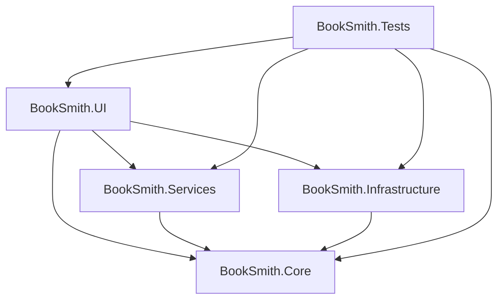

# BookSmith

BookSmith is a modern, lightweight .NET 8 WPF desktop application designed to clean PDF books and convert them into audiobook-friendly EPUB files. It optimizes the text layout for text-to-speech (TTS) readers such as ElevenReader, ensuring a smooth, uninterrupted listening experience.

---

## Features

### 🛠️ Implemented (UI & Architecture)
*   **Modern Dark UI**: A clean, premium dark-themed layout utilizing a grid-based card design, custom styled controls (buttons, textboxes, progress bars, and checkboxes), and fully responsive layout properties.
*   **MVVM Architecture**: Built with a clean separation of concerns using the Model-View-ViewModel pattern, featuring `RelayCommand` and `AsyncRelayCommand` patterns.
*   **Decoupled Navigation**: The `MainWindow` acts as a lightweight navigation shell hosting subviews like `MainView`.
*   **Solution Abstractions**: Core interfaces (`IPdfReader`, `ITextCleaner`, `IEpubExporter`, `IBookPipeline`) are defined in the domain layer.

### 📋 Planned (Processing & Business Logic)
*   **PDF Extraction**: High-fidelity text extraction from PDF files.
*   **Layout Cleaning**:
    *   Automatic headers and footers removal.
    *   Stripping out page numbers.
    *   Merging wrapped lines.
    *   Fixing hyphenated/broken words across lines.
    *   Smart dialogue formatting for character speech.
*   **ElevenReader Optimization**: Special text-formatting mode tailored to speech engines.
*   **EPUB Exporting**: Packaging cleaned text structure into standard EPUB format.
*   **Persistent Configuration**: Saving cleaning options via local app settings.

---

## Architecture

BookSmith follows the principles of Clean Architecture and is split into five distinct projects:



*   **BookSmith.Core**: Contains the domain models, enums, constants, and abstraction interfaces. It has no external project dependencies.
*   **BookSmith.Services**: Holds the business logic implementation for PDF reading, text cleaning algorithms, and EPUB compilation.
*   **BookSmith.Infrastructure**: Manages system concerns such as file input/output, external tools, and local settings storage.
*   **BookSmith.UI**: The WPF desktop application implementing the MVVM presentation layer.
*   **BookSmith.Tests**: An xUnit unit testing project referencing all parts of the solution.

---

## Technology Stack

*   **Runtime**: .NET 8.0
*   **Presentation Layer**: WPF (Windows Presentation Foundation)
*   **Styling**: Modern Custom Control Templates (Dark Mode)
*   **Testing**: xUnit, Microsoft.NET.Test.Sdk
*   **Language Features**: C# 12 (Nullable Reference Types, Implicit Usings)

---

## Folder Structure

```
BookSmith/
├── src/
│   ├── BookSmith.Core/             # Core Domain Layer
│   │   ├── Constants/
│   │   ├── Enums/
│   │   ├── Interfaces/             # IPdfReader, ITextCleaner, etc.
│   │   └── Models/
│   │
│   ├── BookSmith.Services/         # Application Services Layer
│   │   ├── Cleaning/               # Text Cleaning Implementations
│   │   ├── Export/                 # EPUB Packaging Logic
│   │   ├── Interfaces/
│   │   ├── Pdf/                    # PDF Processing Implementations
│   │   └── Pipeline/               # Execution Pipeline Coordination
│   │
│   ├── BookSmith.Infrastructure/   # Infrastructure Layer
│   │   └── Settings/               # AppSettings Class
│   │
│   └── BookSmith.UI/               # WPF Presentation Layer
│       ├── Commands/               # RelayCommand, AsyncRelayCommand
│       ├── Resources/              # ResourceDictionaries (Styles.xaml)
│       ├── Shell/                  # MainWindow (Shell window)
│       ├── ViewModels/             # ViewModels (Main, Settings, etc.)
│       └── Views/                  # MainView UserControl
│
└── tests/
    └── BookSmith.Tests/            # xUnit Test Suite
```

---

## Roadmap

*   [x] Establish solution architecture, projects reference graph, and empty directory structure.
*   [x] Design and implement modern dark-themed UI mockup using WPF.
*   [x] Set up base MVVM plumbing (ViewModels, RelayCommand, AsyncRelayCommand).
*   [ ] Implement PDF reading service using an open-source extraction library.
*   [ ] Write and test layout cleaning filters (header, footer, page number removal).
*   [ ] Implement EPUB exporter service.
*   [ ] Connect processing pipeline with visual progress reporting.
*   [ ] Add settings screen to configure rules persistent across sessions.

---

## Screenshots

*Screenshots will be added once the initial alpha release is finalized.*

---

## Contributing

1.  Fork the repository.
2.  Create your feature branch (`git checkout -b feature/AmazingFeature`).
3.  Commit your changes (`git commit -m 'Add some AmazingFeature'`).
4.  Push to the branch (`git push origin feature/AmazingFeature`).
5.  Open a Pull Request.

---

## License

This project is licensed under the MIT License - see the LICENSE file for details.
